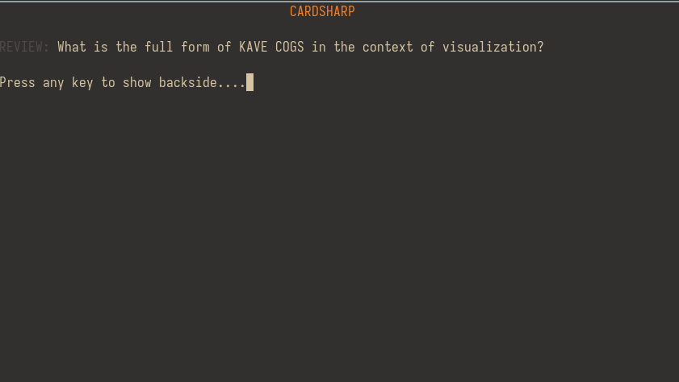
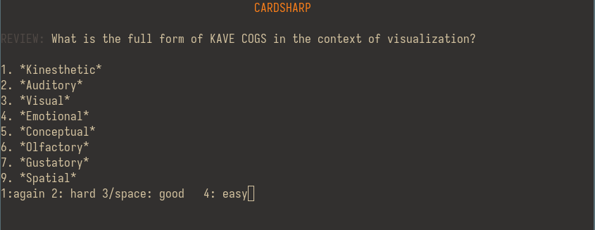

= cardsharp
:source-highlighter: highlight.js
Plain-text oriented terminal flashcards

:fsrs: https://github.com/open-spaced-repetition/fsrs4anki/wiki/The-Algorithm

cardsharp is a terminal based flashcard program
which implements the link:{fsrs}[FSRS] algorithm from Anki.

Its killer feature is that flashcards are stored and organized as part of a regular Markdown document.
footnote:[It is possible to use other plain text formats such as asciidoc or djot as well. Support for more complex formats like Latex and Typst may come in the future]

To create a flashcard, simply use a `REVIEW` block

.example.md
[source,markdown]
----
REVIEW: What is the full form of KAVE COGS in the context of visualization?
1. *Kinesthetic*
2. *Auditory*
3. *Visual*
4. *Emotional*
5. *Conceptual*
6. *Olfactory*
7. *Gustatory*
9. *Spatial*

REVIEW: _Simonides of Ceos_ is said to have invented the memory palace
----

The front of a card is given by the content immediately following `REVIEW:`.
Everything afterwards represents the back, up to the next `REVIEW:` block.
Cloze deletion is represented by using surrounding the term with `_`.

Now upon executing `cardsharp init example.md`
(or any command)
Each of the cards is initialized with a unique 36-bit id.

.example.md
[source,markdown]
----
REVIEW--BC6l5wau: What is the full form of KAVE COGS in the context of visualization?
...

REVIEW--qkgSOPuH: _Simonides of Ceos_ is said to have invented the memory palace
----

This is useful because it allows you to modify the front and back of the cards without losing any spaced repetition information.

Use `cardsharp review` to review the cards.

We can use `cardsharp cards` to see all the cards
....
$ cardsharp cards example.md
1. What is the full form of KAVE COGS in the context of visualization?
stability: 1.29
difficulty: 5.11
predicted recall: 100.00%

2. _________________ is said to have invented the memory palace
stability: 1.29
difficulty: 5.11
predicted recall: 100.00%
....

Since we just reviewed the cards, the predicted recall is 100%.
When the probability dips below 90%, the card is shown again.
